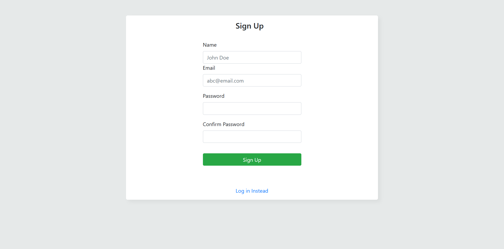
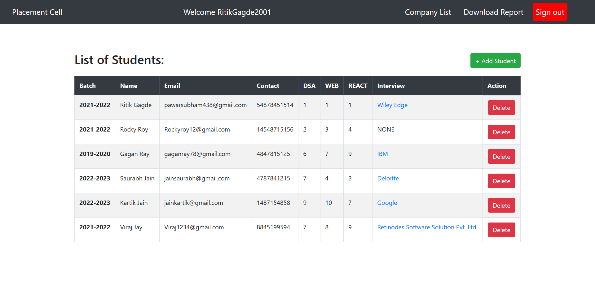

# Placement-Cell

An interface for coding ninjas placement cell to keep records of students and schedule interviews with different companies. This App built using EJS, MongoDB, ExpressJs and PassportJS(For Authentication).

## Features

- Sign up / Sign in forms for employees
- Add a new student to the list of students
- Allocate and schedule interview with different companies and update their result status
- Download reports of students in csv format

## Screenshots

- Sign Up
  

- Sign In
  

- Student Page
  

- Interview Page
  

- Add student
  

- Schedule Interview
  

## Setup

Run `npm install` to install required dependencies
